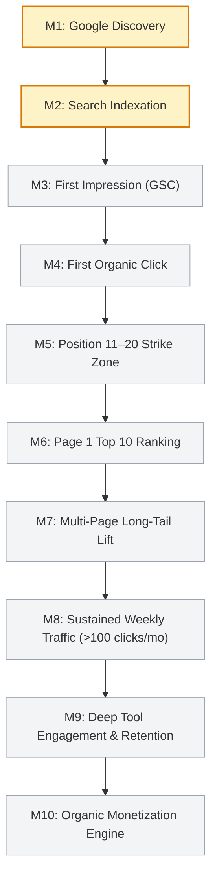

# CrumbCraft Organic SEO Milestones & Progression Tracker

**Project:** CrumbCraft — Artisan Sourdough & Baker's Math Engine  
**Live URL:** `https://mohd34.github.io/crumbcraft/`  
**Tracking Mode:** LIVE DATA MODE & SEO FREEZE (Release v1.0 Frozen)  
**Primary Source of Truth:** Google Search Console Telemetry  
**Last Updated:** 2026-09-24  

---

## 🎯 10-Stage Milestone Trajectory

This milestone framework governs the SEO growth of CrumbCraft from zero baseline through sustained organic monetization. In accordance with the AI SEO Rank Challenge Data Rules, milestones are marked as **ACHIEVED** only when verifiable Google Search Console data confirms the condition. Synthetic Lighthouse scores, local testing, and manual unauthenticated searches do not satisfy milestone gates.

---

## Detailed Milestone Log

### Milestone 1: Search Engine Discovery
- **Condition:** Googlebot or Bingbot makes first verified crawl pass of `robots.txt` and `sitemap.xml`.
- **Target Date:** 2026-09-24 to 2026-10-01
- **Current Status:** 🟡 **IN PROGRESS (Pending Crawler Pass)**
- **Verification Method:** Web server access logs or Search Console "Crawl Stats" report.
- **Protocol Action:** Verify sitemap delivery, monitor robots.txt 200 OK status, ensure zero crawler crawl errors.

### Milestone 2: Core Page Indexation
- **Condition:** At least 7 of the 13 submitted URLs appear in Google Search index (`site:mohd34.github.io/crumbcraft` or GSC "Page Indexing" report).
- **Target Date:** 2026-10-01 to 2026-10-08
- **Current Status:** 🟡 **SUBMITTED / PENDING (13 URLs in sitemap)**
- **Target URLs:**
  1. `index.html` (Sourdough Hydration Engine)
  2. `ddt-calculator.html` (Desired Dough Temp)
  3. `starter-feeding-schedule.html` (Starter Ratio & Peak Predictor)
  4. `fermentation-calculator.html` (Bulk Rise Chart)
  5. `flour-protein-calculator.html` (VWG Blending)
  6. `yeast-converter.html` (Yeast Equivalence)
  7. `loaf-pan-calculator.html` (Pan Scaler)
- **Protocol Action:** Inspect indexing coverage for any `Discovered - currently not indexed` or canonical mismatches.

### Milestone 3: First Organic Search Impression
- **Condition:** Google Search Console Performance report displays $>0$ total impressions for any tracked query.
- **Current Status:** ⚪ **PENDING (Baseline = 0)**
- **Verification Method:** GSC Performance > Search Results (Total Impressions $\ge 1$).
- **Protocol Action:** Document exact query that generated the impression; record initial ranking position.

### Milestone 4: First Organic Search Click
- **Condition:** Google Search Console displays $>0$ clicks from organic search results.
- **Current Status:** ⚪ **PENDING (Baseline = 0)**
- **Verification Method:** GSC Performance > Total Clicks $\ge 1$.
- **Protocol Action:** Audit landing page user journey; verify that landing anchor directly fulfills search intent within 3 seconds.

### Milestone 5: First Query Enters Strike Zone (Positions 11–20)
- **Condition:** Any primary or secondary target query achieves an average Google ranking between 11.0 and 20.0 over a 7-day rolling window.
- **Current Status:** ⚪ **PENDING (Baseline = Pre-Index)**
- **Verification Method:** GSC Performance > Queries filtered by Average Position $\le 20.0$.
- **Protocol Action:** Trigger **Strike Zone Sniping Protocol (EXP-004)**:
  1. Analyze competing Top 3 SERP snippets.
  2. Refine meta title for CTR trigger words (numbers, brackets, instant answers).
  3. Add 2 high-relevance internal contextual links from related guides.

### Milestone 6: First Query Enters Page 1 (Positions 1–10)
- **Condition:** Any target query achieves a confirmed Top 10 Google ranking on desktop or mobile.
- **Current Status:** ⚪ **PENDING**
- **Primary Candidates:**
  - `ddt calculator sourdough` (Lowest competition, high intent)
  - `sourdough ice water ddt formula` (Zero direct competitors covering crushed ice math)
  - `active dry yeast to instant yeast conversion ratio` (Specific formula gap)
- **Protocol Action:** Freeze URL completely; observe CTR stability; prevent any keyword cannibalization.

### Milestone 7: Multi-Page Long-Tail Lift
- **Condition:** At least 4 distinct calculator URLs generate $\ge 25$ organic impressions per week simultaneously.
- **Current Status:** ⚪ **PENDING**
- **Verification Method:** GSC Pages tab demonstrating diversified traffic spread across the cluster.
- **Protocol Action:** Verify topical authority transfer across internal links.

### Milestone 8: Sustained Weekly Traffic Traction
- **Condition:** Site reaches $\ge 100$ organic clicks per month with a site-wide CTR $>3.5\%$.
- **Current Status:** ⚪ **PENDING**
- **Protocol Action:** Review user engagement metrics (calculator sessions, print recipe clicks, preset saves).

### Milestone 9: Deep Tool Engagement & Retention
- **Condition:** $\ge 30\%$ of organic visitors interact with at least two interactive inputs or export their formula via URL share / print.
- **Current Status:** ⚪ **PENDING**
- **Verification Method:** Local telemetry & engagement events.

### Milestone 10: Organic Monetization Engine Activation
- **Condition:** Site sustains $>500$ monthly organic visits and activates zero-friction affiliate recommendations (digital kitchen scales, instant-read thermometers, Danish dough whisks) or sponsor integrations.
- **Current Status:** ⚪ **PENDING**
- **Protocol Action:** Deploy non-intrusive equipment recommendations strictly adhering to user intent.

---

## 🔬 Optimization Decision Matrix

When Search Console telemetry accumulates, all future optimizations must be prioritized using the Opportunity Priority Formula:

$$\text{Opportunity Score} = \text{Impressions} \times \text{Relevance (1-5)} \times \left(\frac{1}{\text{Position}}\right) \times (\text{Benchmark CTR} - \text{Actual CTR})$$

| Opportunity Score | Action Protocol |
| :--- | :--- |
| **High (>15.0)** | Launch single-variable controlled experiment (EXP); update title/schema; monitor 14 days. |
| **Moderate (5.0–15.0)** | Enhance contextual internal linking and add specific FAQ schema. |
| **Low (<5.0)** | Maintain freeze; observe natural rank progression without intervening. |

---

*This milestone document is updated weekly in conjunction with `WEEKLY_SEO_REPORT.md`.*
